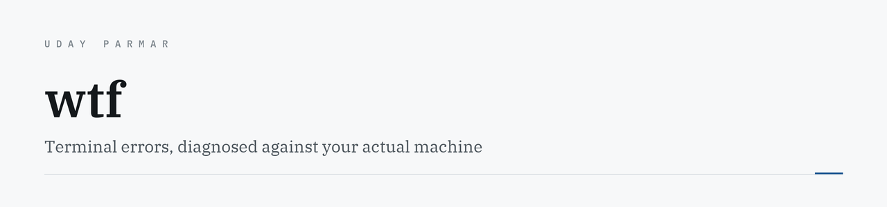
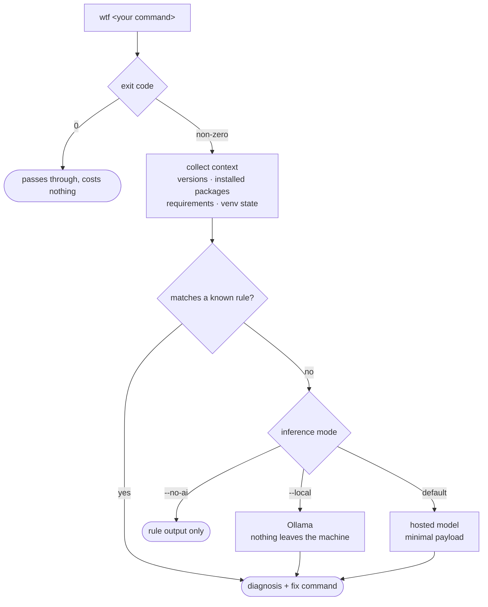

<picture>
  <source media="(prefers-color-scheme: dark)" srcset="assets/banner-dark.png">
  <source media="(prefers-color-scheme: light)" srcset="assets/banner-light.png">
  
</picture>

<p>
  
  
  
  
  <a href="https://uday-parmar.vercel.app/work/wtf"></a>
</p>

Wraps any command. When it fails, diagnoses the error against **your** machine — your Python,
your installed packages, your `requirements.txt`, whether your virtualenv is even active.

```bash
wtf pytest tests/
```

---

## The problem it solves

Pasting a traceback into a chatbot throws away everything that made the error diagnosable.
The model sees the symptom and none of the context, so it guesses at the most common cause
instead of reading yours.

| | Paste into a chatbot | `wtf` |
|---|---|---|
| Knows the error | yes | yes |
| Knows your Python version | no | **yes** |
| Knows what's actually installed | no | **yes** |
| Knows what `requirements.txt` asked for | no | **yes** |
| Detects a version mismatch | no | **yes** |
| Detects an inactive virtualenv | no | **yes** |
| Works with no API key | no | **yes** |
| Works with no network | no | **yes** |

The last two rows are the design, not a feature list. A diagnosis tool that needs the network
is useless for the class of errors that *is* the network.

## How a failure is diagnosed



It engages **only on failure**, so it costs nothing when things work.

## What it sends, exactly

Deliberately little:

- the error message and traceback
- **five lines around the failure**, not whole files
- package names and versions
- environment variable **names only** — never their values
- OS and Python version

```bash
wtf --dry-run pytest tests/   # print the exact payload before anything is sent
wtf --no-ai  pytest tests/    # rule-based only, fully offline
wtf --local  pytest tests/    # Ollama, nothing leaves the machine
```

`--dry-run` exists because "it only sends a little" is a claim, and a claim about your own
source code deserves to be checkable rather than trusted.

## Install

> **Not on PyPI.** The name `wtf-cli` belongs to an unrelated project, so `pip install wtf-cli`
> installs someone else's tool. Install from source until this is renamed.

```bash
git clone https://github.com/Accidental-MVP/wtf.git
cd wtf && pip install -e .
```

## Layout

| Module | Does |
|---|---|
| `runner.py` | Wraps the command, watches the exit code |
| `context.py` | Reads the environment — versions, packages, requirements, venv |
| `parser.py` | Pulls the error and the relevant source lines out of the traceback |
| `rules.py` | Rule-based diagnosis, the path that needs no model |
| `ai.py` | Model inference, local or hosted |
| `formatter.py` | Terminal output |

Each has a test file in `tests/`.

---

<sub>Built by <a href="https://uday-parmar.vercel.app">Uday Parmar</a></sub>
